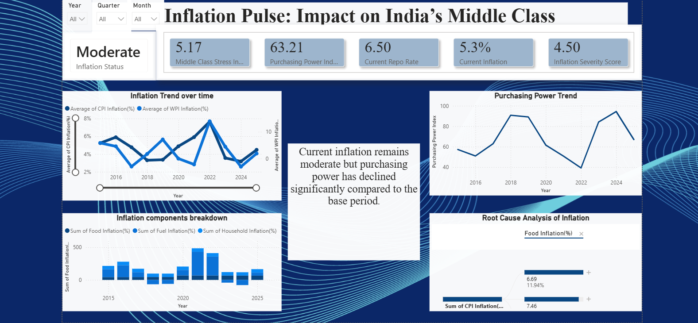
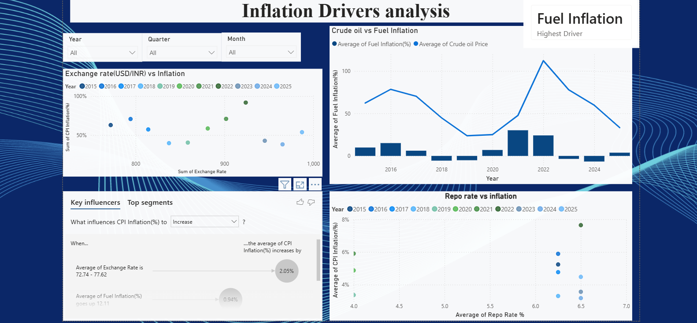
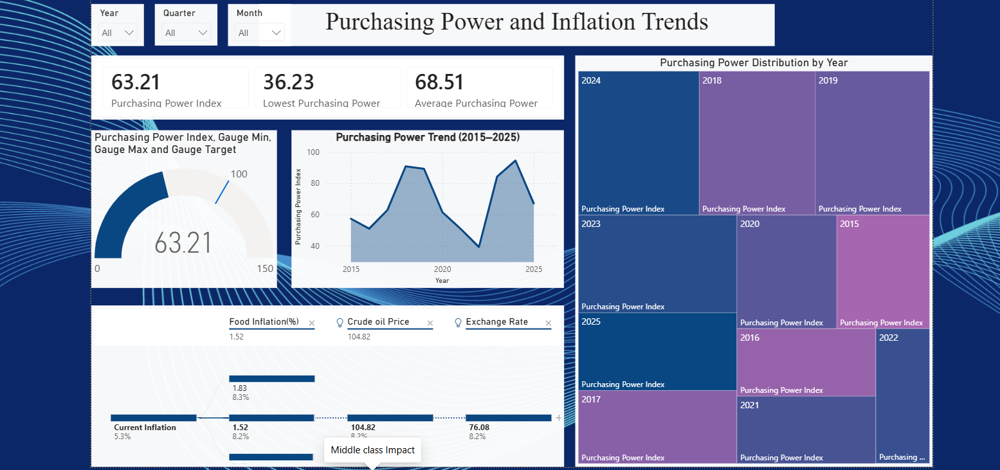
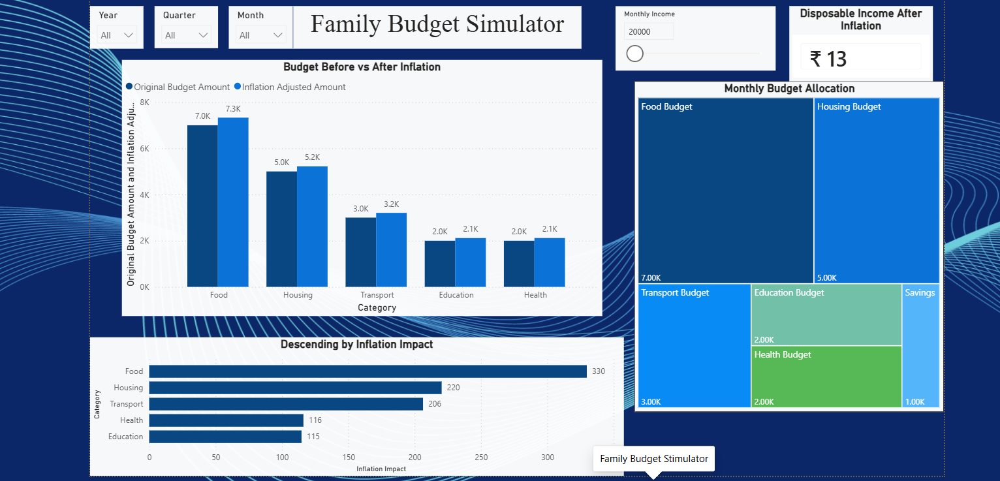
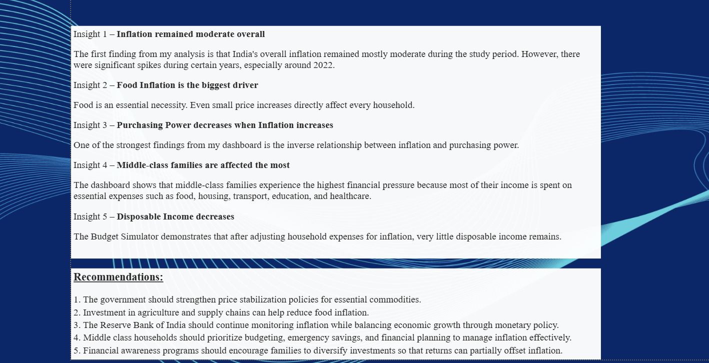

# Inflation Pulse: Understanding Inflation and Its Impact on India's Middle-Class Families

## 📊 Project Overview

Inflation affects everyday household decisions, especially for middle-class families. This project uses Power BI to explore inflation trends in India and understand how changes in prices can affect household spending and purchasing power.

## 🎯 Objective

The objective of this project is to analyse inflation patterns, identify the major factors influencing inflation, and present their impact through an interactive Power BI dashboard.

## 🛠️ Tools & Technologies

- Microsoft Power BI
- Excel
- Data Analysis
- Data Visualisation
- DAX
- Statistics

## 📈 Key Areas Analysed

- CPI Inflation
- WPI Inflation
- Food Inflation
- Fuel Inflation
- Repo Rate
- Household Inflation
- Purchasing Power
- USD/INR
- Brent Crude
- Middle-Class Household Impact

## 📑 Dashboard Pages

1. Executive Overview
2. Inflation Drivers
3. Middle-Class Impact
4. Purchasing Power
5. Family Budget Simulator
6. Correlation Analysis
7. Key Insights

## 💡 Project Outcome

The dashboard transforms economic data into clear and interactive visual insights, helping users understand inflation trends and their potential impact on household budgets and purchasing power.

## 👩‍💻 About the Project

This project was developed as part of my data analytics learning journey, combining my background in Economics with practical data analysis and visualisation skills.

## 📸 Dashboard Preview

### 1. Executive Overview

### 2. Inflation Drivers Analysis

### 3. Middle-Class Impact

### 4. Purchasing Power Analysis

### 5. Family Budget Simulator

### 6. Insights & Recommendations

### Key Insights

